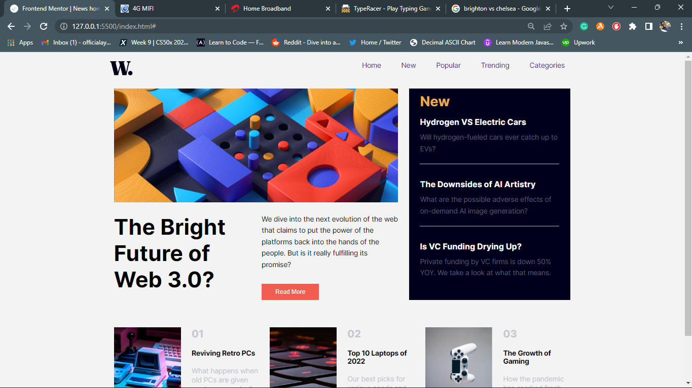
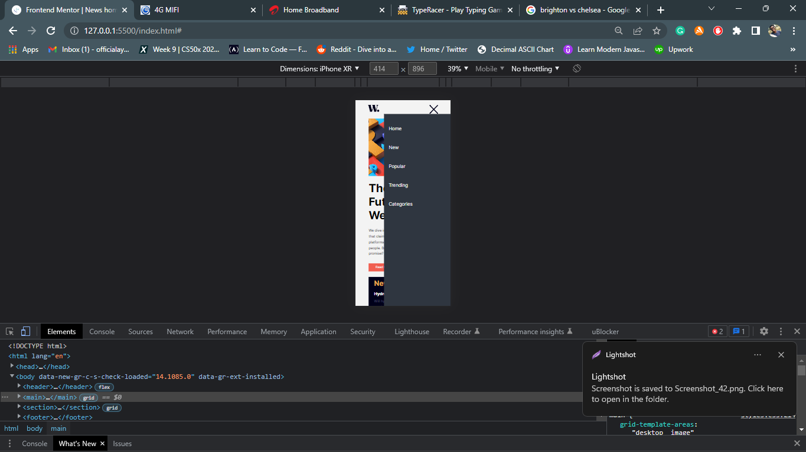

# Frontend Mentor - News homepage solution

This is a solution to the [News homepage challenge on Frontend Mentor](https://www.frontendmentor.io/challenges/news-homepage-H6SWTa1MFl). Frontend Mentor challenges help you improve your coding skills by building realistic projects.

## Table of contents

- [Overview](#overview)
  - [The challenge](#the-challenge)
  - [Screenshot](#screenshot)
  - [Links](#links)
- [My process](#my-process)
  - [Built with](#built-with)
- [Author](#author)

## Overview

### The challenge

Users should be able to:

- View the optimal layout for the interface depending on their device's screen size
- See hover and focus states for all interactive elements on the page
- **Bonus**: Toggle the mobile menu (requires some JavaScript)

### Screenshot

### Links

- Solution URL: [solution URL here](https://www.frontendmentor.io/solutions/responsive-news-homepage-built-using-css-grid-and-javascript-QlnvpcEP_Z)
- Live Site URL: [live site URL here](https://news-homepagemain.netlify.app/)

## My process

Desktop-first workflow

### Built with

- Semantic HTML5 markup
- CSS custom properties
- Flexbox
- CSS Grid
- Desktop-first workflow
- Custom CSS Combinators

## Author

- Website - [Abdullah Ayoola](https://github.com/abdullah43577)
- Frontend Mentor - [@abdullah43577](https://www.frontendmentor.io/profile/abdullah43577)
- Twitter - [@officialayo540](https://twitter.com/officialayo540)

https://user-images.githubusercontent.com/100965547/198843811-6c9cb45e-aae4-4d80-8bf5-11267699a50f.mp4
